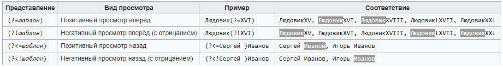

## Некоторые символьные классы можно заменить специальными метасимволами

## Просмотр вперёд и назад

В регулярных выражениях есть возможность производить поиск фрагмента текста, «просматривая» (но не включая в найденное) окружающий текст, который расположен до или после искомого фрагмента текста:

